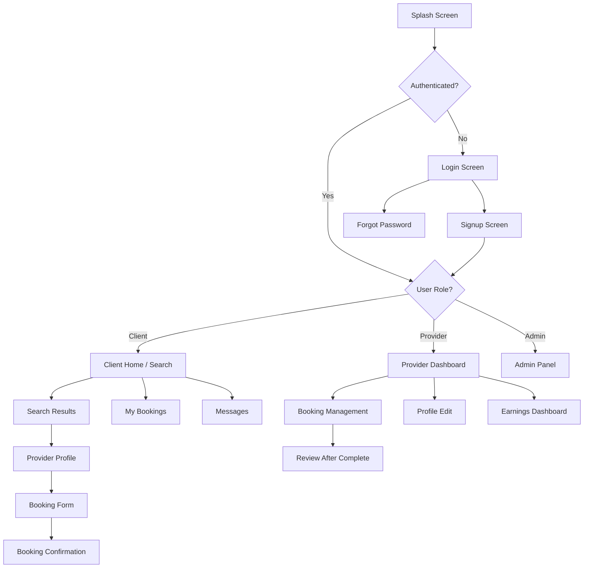
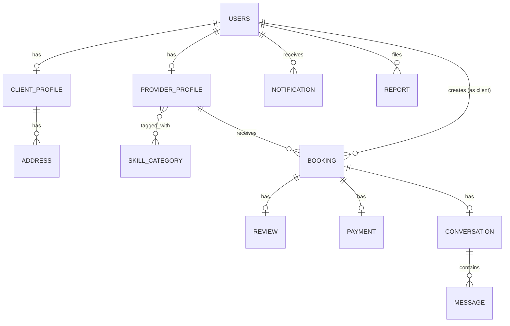

# SkillLink — Full Implementation Plan (4 Sprints)

> A digital service marketplace connecting clients with skilled professionals in Pakistan.
> **Backend**: Java (Spring Boot) · **Frontend**: React Native (Expo) — Desktop + Mobile
> **Team ENIGMA** · CS3009 Software Engineering · Spring 2026

---

## Table of Contents

1. [Architecture Overview](#1-architecture-overview)
2. [Technology Stack](#2-technology-stack)
3. [Project Structure](#3-project-structure)
4. [UI/UX Design System](#4-uiux-design-system)
5. [Sprint 1 — User Identity & Profile Management](#5-sprint-1--user-identity--profile-management)
6. [Sprint 2 — Search & Discovery + Booking & Scheduling](#6-sprint-2--search--discovery--booking--scheduling)
7. [Sprint 3 — Reviews & Ratings + In-App Messaging](#7-sprint-3--reviews--ratings--in-app-messaging)
8. [Sprint 4 — Payments + Admin & Moderation](#8-sprint-4--payments--admin--moderation)
9. [Database Schema](#9-database-schema)
10. [API Design](#10-api-design)
11. [Verification Plan](#11-verification-plan)

---

## 1. Architecture Overview

```
┌──────────────────────────────────────────────────────┐
│                 React Native (Expo)                  │
│          Desktop (Windows/Mac) + Mobile (iOS/Android) │
│                                                      │
│  ┌─────────┐ ┌──────────┐ ┌────────┐ ┌───────────┐  │
│  │  Auth   │ │  Search  │ │Booking │ │  Payments │  │
│  │ Screens │ │ & Browse │ │  Flow  │ │  & Admin  │  │
│  └────┬────┘ └────┬─────┘ └───┬────┘ └─────┬─────┘  │
│       │           │           │             │        │
│       └───────────┴─────┬─────┴─────────────┘        │
│                     REST API                         │
└─────────────────────────┬────────────────────────────┘
                          │  HTTP/JSON
┌─────────────────────────┴────────────────────────────┐
│              Java Spring Boot Backend                │
│                                                      │
│  ┌──────────┐ ┌───────────┐ ┌──────────────────────┐ │
│  │Controller│→│  Service  │→│    Repository (JPA)  │ │
│  │  Layer   │ │   Layer   │ │                      │ │
│  └──────────┘ └───────────┘ └──────────┬───────────┘ │
│                                        │             │
│  ┌──────────┐ ┌───────────┐ ┌──────────┴───────────┐ │
│  │   JWT    │ │WebSocket  │ │    PostgreSQL DB     │ │
│  │  Auth    │ │(Messaging)│ │                      │ │
│  └──────────┘ └───────────┘ └──────────────────────┘ │
└──────────────────────────────────────────────────────┘
```

**Key Decisions:**
- **React Native (Expo)** enables single codebase for mobile (iOS/Android) + desktop (Windows/Mac via Electron or `react-native-windows`)
- **Java Spring Boot** satisfies the university Java requirement and provides robust REST API, security, and ORM
- **PostgreSQL** for relational data (users, bookings, reviews)
- **WebSocket (STOMP)** for real-time messaging and notifications
- **JWT** for stateless authentication across all platforms

---

## 2. Technology Stack

### Backend
| Component | Technology | Version |
|---|---|---|
| Runtime | Java | 17 LTS |
| Framework | Spring Boot | 3.2.x |
| Security | Spring Security + JWT (jjwt) | — |
| ORM | Spring Data JPA + Hibernate | — |
| Database | PostgreSQL | 16 |
| WebSocket | Spring WebSocket (STOMP) | — |
| API Docs | SpringDoc OpenAPI (Swagger) | — |
| Build | Maven | 3.9.x |
| Testing | JUnit 5 + Mockito | — |
| Password Hashing | BCrypt (Spring Security) | — |

### Frontend
| Component | Technology | Version |
|---|---|---|
| Framework | React Native | 0.76.x |
| Toolkit | Expo | SDK 52 |
| Navigation | React Navigation v7 | — |
| State Mgmt | Zustand | 5.x |
| HTTP Client | Axios | — |
| Forms | React Hook Form + Zod | — |
| Icons | Lucide React Native | — |
| Animations | React Native Reanimated 3 | — |
| Date Picker | @react-native-community/datetimepicker | — |
| Desktop | react-native-windows / Electron | — |

---

## 3. Project Structure

```
SkillLink/
├── backend/                          # Java Spring Boot
│   ├── pom.xml
│   └── src/
│       ├── main/
│       │   ├── java/com/skilllink/
│       │   │   ├── SkillLinkApplication.java
│       │   │   ├── config/
│       │   │   │   ├── SecurityConfig.java
│       │   │   │   ├── JwtConfig.java
│       │   │   │   ├── WebSocketConfig.java
│       │   │   │   └── CorsConfig.java
│       │   │   ├── controller/
│       │   │   │   ├── AuthController.java
│       │   │   │   ├── UserController.java
│       │   │   │   ├── ProviderController.java
│       │   │   │   ├── SearchController.java
│       │   │   │   ├── BookingController.java
│       │   │   │   ├── ReviewController.java
│       │   │   │   ├── MessageController.java
│       │   │   │   ├── PaymentController.java
│       │   │   │   └── AdminController.java
│       │   │   ├── dto/
│       │   │   │   ├── request/        # SignupRequest, LoginRequest, etc.
│       │   │   │   └── response/       # AuthResponse, ProviderDTO, etc.
│       │   │   ├── entity/
│       │   │   │   ├── User.java
│       │   │   │   ├── ProviderProfile.java
│       │   │   │   ├── ClientProfile.java
│       │   │   │   ├── SkillCategory.java
│       │   │   │   ├── Booking.java
│       │   │   │   ├── Review.java
│       │   │   │   ├── Message.java
│       │   │   │   ├── Conversation.java
│       │   │   │   ├── Payment.java
│       │   │   │   └── Notification.java
│       │   │   ├── repository/
│       │   │   ├── service/
│       │   │   ├── security/
│       │   │   │   ├── JwtTokenProvider.java
│       │   │   │   ├── JwtAuthenticationFilter.java
│       │   │   │   └── CustomUserDetailsService.java
│       │   │   └── exception/
│       │   │       ├── GlobalExceptionHandler.java
│       │   │       └── ResourceNotFoundException.java
│       │   └── resources/
│       │       ├── application.yml
│       │       └── data.sql               # seed skill categories
│       └── test/
│           └── java/com/skilllink/
│               ├── controller/
│               ├── service/
│               └── repository/
│
├── frontend/                          # React Native (Expo)
│   ├── app.json
│   ├── package.json
│   ├── App.tsx
│   ├── src/
│   │   ├── api/
│   │   │   ├── client.ts               # Axios instance with JWT interceptor
│   │   │   ├── auth.ts
│   │   │   ├── providers.ts
│   │   │   ├── bookings.ts
│   │   │   ├── reviews.ts
│   │   │   ├── messages.ts
│   │   │   └── payments.ts
│   │   ├── components/
│   │   │   ├── common/                 # Button, Input, Card, Avatar, Badge, etc.
│   │   │   ├── auth/                   # LoginForm, SignupForm
│   │   │   ├── provider/              # ProviderCard, ProfileView, SkillBadge
│   │   │   ├── booking/              # BookingForm, BookingCard, StatusBadge
│   │   │   ├── review/               # ReviewCard, RatingStars, ReviewForm
│   │   │   ├── messaging/            # ChatBubble, ConversationItem
│   │   │   └── payment/              # PaymentForm, EarningsSummary
│   │   ├── navigation/
│   │   │   ├── AppNavigator.tsx
│   │   │   ├── AuthStack.tsx
│   │   │   ├── ClientTabs.tsx
│   │   │   └── ProviderTabs.tsx
│   │   ├── screens/
│   │   │   ├── auth/                  # LoginScreen, SignupScreen, ForgotPasswordScreen
│   │   │   ├── client/               # HomeScreen, SearchScreen, ProviderProfileScreen
│   │   │   │                          # BookingFormScreen, MyBookingsScreen
│   │   │   ├── provider/             # DashboardScreen, BookingMgmtScreen, ProfileEditScreen
│   │   │   ├── shared/               # ProfileSettingsScreen, MessagesScreen, ChatScreen
│   │   │   └── admin/                # AdminDashboardScreen, UserMgmtScreen
│   │   ├── store/
│   │   │   ├── authStore.ts
│   │   │   ├── bookingStore.ts
│   │   │   └── notificationStore.ts
│   │   ├── theme/
│   │   │   ├── colors.ts              # Design tokens
│   │   │   ├── typography.ts
│   │   │   ├── spacing.ts
│   │   │   └── index.ts
│   │   ├── utils/
│   │   │   ├── validators.ts
│   │   │   ├── formatters.ts
│   │   │   └── constants.ts
│   │   └── types/
│   │       └── index.ts
│   └── assets/
│       ├── fonts/
│       └── images/
│
└── docs/                              # Existing deliverable docs
    ├── SkillLink_Deliverable1.pdf
    └── SkillLink_Deliverable2_Final.pdf
```

---

## 4. UI/UX Design System

### Design Philosophy
Modern, premium, trust-building. The marketplace targets everyday Pakistanis — the UI must be **instantly intuitive**, **warm**, and **professional**.

### Color Palette
| Token | Hex | Usage |
|---|---|---|
| `primary` | `#6C63FF` | Buttons, links, active states (electric indigo) |
| `primaryDark` | `#5A52D5` | Pressed states, headers |
| `secondary` | `#00D9A6` | Success, online indicators, CTAs (mint green) |
| `accent` | `#FF6B6B` | Urgency, decline, errors (coral) |
| `bgDark` | `#0F0F1A` | Primary background (deep navy) |
| `bgCard` | `#1A1A2E` | Card surfaces |
| `bgElevated` | `#252542` | Modals, elevated surfaces |
| `textPrimary` | `#FFFFFF` | Primary text |
| `textSecondary` | `#A0A0B8` | Secondary/muted text |
| `textMuted` | `#6B6B80` | Hints, placeholders |
| `border` | `#2A2A45` | Subtle borders |
| `gradient1` | `#6C63FF → #A855F7` | Hero gradients |
| `star` | `#FFD700` | Rating stars |

### Typography (Google Fonts)
- **Headings**: `Outfit` (600/700 weight) — Modern geometric sans
- **Body**: `Inter` (400/500 weight) — Excellent readability
- **Monospace**: `JetBrains Mono` — Codes, IDs, numbers

### Component Style Guidelines
- **Cards**: Rounded corners (16px), subtle glass-morphism (`rgba(255,255,255,0.05)` bg + blur), hover lift animation
- **Buttons**: Gradient fills for primary, ghost/outline for secondary. 48px min touch target. Press animation (scale 0.97)
- **Inputs**: Semi-transparent bg, bottom border accent on focus, floating labels
- **Avatars**: Circular with gradient border ring for verified providers
- **Status Badges**: Pill-shaped, color-coded (`Pending` = amber, `Accepted` = green, `Declined` = coral)
- **Navigation**: Bottom tab bar (mobile) with animated indicator dot. Side rail (desktop)
- **Transitions**: `react-native-reanimated` shared-element transitions between screens, spring physics

### Screen Flow (High Level)



---

## 5. Sprint 1 — User Identity & Profile Management

> **Sprint Goal**: Establish foundational architecture for user onboarding and role-based profile management.
> **Duration**: 3 weeks

### User Stories

| ID | Story | Priority |
|---|---|---|
| US-01 | Account Registration (Client/Provider role selection, email validation, strong password) | Must |
| US-02 | Secure Authentication (JWT login, Forgot Password, Remember Me) | Must |
| US-03 | Provider Profile Setup (avatar, skills, bio, portfolio links) | Must |
| US-04 | Client Contact Management (phone, address, multiple locations) | Should |

### Backend Implementation

#### [NEW] `SkillLinkApplication.java` — Spring Boot entry point

#### [NEW] `config/SecurityConfig.java`
- Configure Spring Security with JWT filter chain
- Whitelist `/api/auth/**` endpoints
- Enable CORS for React Native origins
- Wire BCrypt password encoder bean

#### [NEW] `security/JwtTokenProvider.java`
- Generate JWT tokens with `userId`, `email`, `role` claims
- Token expiry: 24h access token, 7d refresh token
- Validate and parse tokens

#### [NEW] `security/JwtAuthenticationFilter.java`
- `OncePerRequestFilter` that extracts JWT from `Authorization: Bearer` header
- Sets `SecurityContext` on valid token

#### [NEW] `entity/User.java`
```java
@Entity @Table(name = "users")
public class User {
    @Id @GeneratedValue Long id;
    String fullName;
    @Column(unique = true) String email;
    String passwordHash;
    @Enumerated(EnumType.STRING) Role role;  // CLIENT, PROVIDER, ADMIN
    Boolean emailVerified;
    Boolean isActive;
    LocalDateTime createdAt;
    LocalDateTime updatedAt;
}
```

#### [NEW] `entity/ProviderProfile.java`
```java
@Entity
public class ProviderProfile {
    @Id @GeneratedValue Long id;
    @OneToOne @JoinColumn(name = "user_id") User user;
    String bio;              // min 50 chars
    String avatarUrl;
    @ManyToMany List<SkillCategory> skills;   // 1-5
    @ElementCollection List<String> portfolioLinks;
    String city;
    Double avgRating;        // denormalized for search perf
    Integer totalReviews;
    Boolean isVerified;
}
```

#### [NEW] `entity/ClientProfile.java`
```java
@Entity
public class ClientProfile {
    @Id @GeneratedValue Long id;
    @OneToOne @JoinColumn(name = "user_id") User user;
    String phoneNumber;      // 11-digit PK format
    @OneToMany List<Address> addresses;
    String avatarUrl;
}
```

#### [NEW] `entity/SkillCategory.java`
- Predefined taxonomy: Plumbing, Electrical, Graphic Design, Tutoring, Software Dev, Cleaning, Carpentry, Photography, AC Repair, Painting, Welding, Tailoring, Catering, Driving, Beauty, Fitness, Legal, Accounting, Marketing, Writing
- Seeded via `data.sql`

#### [NEW] `controller/AuthController.java`
- `POST /api/auth/signup` — Create account with role selection
- `POST /api/auth/login` — Authenticate, return JWT pair
- `POST /api/auth/forgot-password` — Send reset email
- `POST /api/auth/reset-password` — Reset with token
- `POST /api/auth/refresh-token` — Refresh access token

#### [NEW] `controller/UserController.java`
- `GET /api/users/me` — Get current user profile
- `PUT /api/users/me` — Update basic info

#### [NEW] `controller/ProviderController.java`
- `GET /api/providers/{id}` — Public provider profile
- `PUT /api/providers/profile` — Update provider profile (bio, skills, portfolio)
- `POST /api/providers/avatar` — Upload avatar image

#### [NEW] `service/AuthService.java`
- Registration logic: validate email uniqueness, hash password (BCrypt), create user + role-specific profile
- Login logic: verify credentials, generate JWT pair
- Password reset: generate time-limited token, send email

### Frontend Implementation

#### [NEW] `src/theme/` — Complete design system
- `colors.ts` — All color tokens from design system above
- `typography.ts` — Font families, sizes, weights
- `spacing.ts` — 4px grid spacing scale

#### [NEW] `src/api/client.ts`
- Axios instance with `baseURL` pointed at Spring Boot
- Request interceptor: attach `Authorization: Bearer <token>` from secure storage
- Response interceptor: auto-refresh on 401, redirect to login on refresh failure

#### [NEW] Auth Screens
- **LoginScreen**: Email + password fields, gradient background, animated logo, "Remember Me" toggle, "Forgot Password" link, social-style divider and signup CTA
- **SignupScreen**: Multi-step form — (1) Name + Email + Password, (2) Role selection (Client/Provider cards with icons and descriptions), (3) Success animation
- **ForgotPasswordScreen**: Email input, submit → confirmation toast

#### [NEW] Provider Profile Edit Screen
- Avatar upload with crop (circular mask)
- Skills multi-select (chip selector, max 5)
- Rich bio textarea with live character counter (min 50)
- Portfolio link inputs with URL validation, add/remove
- City selection dropdown

#### [NEW] Client Profile Settings Screen
- Phone number input with PK 11-digit mask
- Address management: add/edit/delete addresses
- Primary address toggle

---

## 6. Sprint 2 — Search & Discovery + Booking & Scheduling

> **Sprint Goal**: Enable users to search and discover service providers, and allow clients to submit and manage booking requests.
> **Duration**: 3 weeks

### User Stories

| ID | Story | Priority |
|---|---|---|
| US-04 | Client Contact Management — leftover from Sprint 1 | Must |
| US-05 | Service Search & Filtering (full-text, category, city, rating) | Must |
| US-06 | Provider Profile View (public profile with reviews, Book Now) | Must |
| US-07 | Booking Request Submission (date/time picker, job description, notifications) | Must |
| US-08 | Booking Management Dashboard (accept/decline with notifications) | Must |

### Backend Implementation

#### [NEW] `controller/SearchController.java`
- `GET /api/search/providers` — Full-text search endpoint
  - Query params: `q` (search string), `categoryId`, `city`, `minRating`, `page`, `size`
  - Returns paginated `ProviderSummaryDTO` list
  - Uses JPA Specification for dynamic filtering
  - Ordered by `avgRating DESC`, then profile completeness

#### [NEW] `entity/Booking.java`
```java
@Entity
public class Booking {
    @Id @GeneratedValue Long id;
    @ManyToOne Client client;
    @ManyToOne ProviderProfile provider;
    LocalDate preferredDate;
    LocalTime preferredTime;
    @Column(length = 1000) String jobDescription;  // 20-1000 chars
    @Enumerated(EnumType.STRING) BookingStatus status;  // PENDING, ACCEPTED, DECLINED, COMPLETED, CANCELLED
    String declineReason;
    LocalDateTime createdAt;
    LocalDateTime updatedAt;
}
```

#### [NEW] `controller/BookingController.java`
- `POST /api/bookings` — Create booking (client only)
  - Validate: future date, description >= 20 chars, slot conflict check
  - Dispatch notification to provider
- `GET /api/bookings/my` — List user's bookings (client or provider view)
- `PUT /api/bookings/{id}/action` — Accept/Decline (provider only)
  - Validate: booking belongs to provider, status is PENDING
  - `declineReason` required if action = DECLINE
  - Send notification to client

#### [NEW] `entity/Notification.java`
```java
@Entity
public class Notification {
    @Id @GeneratedValue Long id;
    @ManyToOne User recipient;
    String title;
    String message;
    String type;        // BOOKING_NEW, BOOKING_ACCEPTED, BOOKING_DECLINED, etc.
    Long referenceId;   // bookingId, etc.
    Boolean isRead;
    LocalDateTime createdAt;
}
```

### Frontend Implementation

#### [NEW] Client Home / Search Screen
- Hero section with gradient background, greeting text, search bar
- Category chips row (horizontal scroll with icons)
- "Top Rated Providers" carousel
- Full search view: filter panel (category dropdown, city selector, rating slider), search results as cards in a `FlatList`

#### [NEW] Provider Card Component
- Provider avatar with verified badge ring
- Name, top skill badge, city, star rating (gold stars)
- Subtle shadow lift on press, spring-scaling animation

#### [NEW] Provider Profile Screen
- Full-bleed header with avatar, gradient backdrop
- Skill badges row
- Bio section
- Portfolio links (icons: GitHub, Behance, LinkedIn, etc.)
- Aggregate rating (large star + "4.7 / 5.0 from 23 reviews")
- Reviews list (scrollable, with client avatar, text, timestamp)
- Sticky bottom "Book Now" button (gradient, animated)

#### [NEW] Booking Form Screen
- Provider mini-card at top
- Date picker (native, past dates disabled)
- Time picker
- Job description textarea with live character counter (min 20)
- "Confirm Booking" button (disabled until all valid)
- Success animation screen with booking ID + status badge

#### [NEW] Provider Booking Dashboard
- Segmented tabs: Pending / Accepted / Declined / All
- Booking cards with: client name, job description preview, date/time, status badge
- Swipe-to-accept/decline or button actions
- Decline modal with reason textarea
- Real-time badge count on tab bar for pending bookings

---

## 7. Sprint 3 — Reviews & Ratings + In-App Messaging

> **Sprint Goal**: Enable post-service reviews and real-time messaging between clients and providers.
> **Duration**: 3 weeks

### User Stories

| ID | Story | Priority |
|---|---|---|
| US-09 | Post-Service Review & Rating — Client can leave a star rating (1-5) and written review after a booking is marked complete | Must |
| US-10 | Provider Review Response — Provider can write a public response to any review on their profile | Should |
| US-11 | Review Display & Aggregation — Provider profile shows aggregate rating + paginated individual reviews | Must |
| US-12 | In-App Messaging — Real-time chat between client and provider for a booking | Must |
| US-13 | Notification System — Push-style in-app notifications for bookings, messages, reviews | Must |

### Backend Implementation

#### [NEW] `entity/Review.java`
```java
@Entity
public class Review {
    @Id @GeneratedValue Long id;
    @ManyToOne Booking booking;         // one review per completed booking
    @ManyToOne User client;
    @ManyToOne ProviderProfile provider;
    Integer rating;                      // 1-5
    @Column(length = 1000) String comment;
    String providerResponse;             // optional
    LocalDateTime createdAt;
    LocalDateTime respondedAt;
}
```

#### [NEW] `controller/ReviewController.java`
- `POST /api/reviews` — Submit review (client only, booking must be COMPLETED, no duplicate)
- `GET /api/reviews/provider/{id}?page=&size=` — Paginated reviews for provider
- `PUT /api/reviews/{id}/respond` — Provider response
- After review submission: recalculate `avgRating` + `totalReviews` on `ProviderProfile`

#### [NEW] `entity/Conversation.java` + `entity/Message.java`
```java
@Entity
public class Conversation {
    @Id @GeneratedValue Long id;
    @ManyToOne Booking booking;      // linked to a booking
    @ManyToOne User client;
    @ManyToOne User provider;
    LocalDateTime lastMessageAt;
}

@Entity
public class Message {
    @Id @GeneratedValue Long id;
    @ManyToOne Conversation conversation;
    @ManyToOne User sender;
    @Column(length = 2000) String content;
    Boolean isRead;
    LocalDateTime sentAt;
}
```

#### [NEW] `config/WebSocketConfig.java`
- STOMP over WebSocket at `/ws`
- Message broker for `/topic/` (broadcasts) and `/queue/` (user-specific)
- User destinations: `/user/queue/messages`, `/user/queue/notifications`

#### [NEW] `controller/MessageController.java`
- `GET /api/conversations` — List user's conversations
- `GET /api/conversations/{id}/messages?page=` — Paginated messages
- `POST /api/conversations/{id}/messages` — Send message (also dispatched via WebSocket)
- WebSocket: `@MessageMapping("/chat.send")` — Real-time message delivery

### Frontend Implementation

#### [NEW] Review Form Component
- Star rating selector (animated tap-to-fill stars, haptic feedback)
- Review text area with character counter
- Appears after client marks booking as "Completed"

#### [NEW] Review Card Component
- Client avatar + name + timestamp
- Star display (filled/empty stars in gold)
- Review text
- Provider response section (indented, different bg tint)

#### [NEW] Messages Screen
- Conversation list with: other user's avatar, name, last message preview, timestamp, unread badge
- Sorted by most recent

#### [NEW] Chat Screen
- Chat bubble UI (sender = right/purple, receiver = left/dark card)
- Real-time via WebSocket
- Input bar with send button, animation on send
- Provider/Client info header with booking context
- Auto-scroll to bottom on new message

#### [NEW] Notifications Screen
- Grouped by type (Bookings, Messages, Reviews)
- Each notification: icon, title, message, timestamp, read/unread indicator
- Tap to navigate to relevant screen
- "Mark all as read" action

---

## 8. Sprint 4 — Payments + Admin & Moderation

> **Sprint Goal**: Complete the marketplace loop with payment processing and provide admin tools for platform management.
> **Duration**: 3 weeks

### User Stories

| ID | Story | Priority |
|---|---|---|
| US-14 | Payment Integration — Client pays for accepted bookings through secure in-app payment | Must |
| US-15 | Earnings Dashboard — Provider views earnings history, pending payouts, and total revenue | Must |
| US-16 | Admin User Management — Admin can view, search, activate/deactivate users | Must |
| US-17 | Admin Content Moderation — Admin can review reported profiles/reviews and take action | Should |
| US-18 | Admin Analytics Dashboard — Admin views platform stats (registrations, bookings, revenue) | Should |
| US-19 | Booking Completion Flow — Client marks booking as complete triggering payment and review | Must |

### Backend Implementation

#### [NEW] `entity/Payment.java`
```java
@Entity
public class Payment {
    @Id @GeneratedValue Long id;
    @OneToOne Booking booking;
    @ManyToOne User client;
    @ManyToOne User provider;
    BigDecimal amount;
    BigDecimal platformFee;          // 10% commission
    BigDecimal providerEarnings;
    @Enumerated PaymentStatus status;  // PENDING, COMPLETED, REFUNDED
    String transactionRef;
    LocalDateTime paidAt;
}
```

#### [NEW] `controller/PaymentController.java`
- `POST /api/payments/initiate` — Create payment for completed booking
- `POST /api/payments/confirm` — Confirm payment (webhook or client confirm)
- `GET /api/payments/earnings` — Provider's earnings summary
- `GET /api/payments/history` — Paginated payment history

> [!NOTE]
> For the university project, we simulate payment processing (no real gateway). The UI mimics a real payment flow with card input, but the backend auto-confirms. This can be swapped for a real gateway (Stripe, JazzCash, etc.) in production.

#### [NEW] `controller/AdminController.java`
- `GET /api/admin/users?page=&search=&role=&status=` — Paginated user list with filters
- `PUT /api/admin/users/{id}/status` — Activate/deactivate user
- `GET /api/admin/reports` — Reported content list
- `PUT /api/admin/reports/{id}/action` — Resolve report (warn, suspend, dismiss)
- `GET /api/admin/analytics` — Dashboard stats (total users, bookings, revenue, weekly trends)

#### Booking Completion Flow
- `PUT /api/bookings/{id}/complete` — Client marks booking complete
  - Changes status to `COMPLETED`
  - Triggers payment initiation
  - Triggers review prompt notification to client

### Frontend Implementation

#### [NEW] Payment Screen
- Booking summary card
- Amount breakdown (service fee, platform fee, total)
- Simulated card input (card number, expiry, CVV — visually polished)
- "Pay Now" gradient button
- Processing animation → Success screen with receipt

#### [NEW] Provider Earnings Dashboard
- Summary cards: Total Earnings, Pending Payouts, This Month
- Earnings chart (bar chart by week/month)
- Transaction history list

#### [NEW] Admin Panel Screens (role = ADMIN)
- **Admin Dashboard**: Stats cards (Total Users, Active Providers, Bookings This Week, Revenue) with mini charts
- **User Management**: Searchable user table with role filter, status toggle, view profile
- **Reports**: Reported content cards with Review button, actions (Warn, Suspend, Dismiss)
- **Analytics**: Charts — Registrations over time, Bookings trend, Revenue breakdown, Top categories

---

## 9. Database Schema



**Key Tables**: `users`, `provider_profiles`, `client_profiles`, `addresses`, `skill_categories`, `provider_skills` (join), `bookings`, `reviews`, `payments`, `conversations`, `messages`, `notifications`, `reports`

---

## 10. API Design

### Authentication
| Method | Endpoint | Description |
|---|---|---|
| POST | `/api/auth/signup` | Register new user |
| POST | `/api/auth/login` | Login, returns JWT pair |
| POST | `/api/auth/forgot-password` | Send password reset email |
| POST | `/api/auth/reset-password` | Reset password with token |
| POST | `/api/auth/refresh-token` | Refresh access token |

### User & Profile
| Method | Endpoint | Description |
|---|---|---|
| GET | `/api/users/me` | Current user profile |
| PUT | `/api/users/me` | Update user info |
| PUT | `/api/providers/profile` | Update provider profile |
| POST | `/api/providers/avatar` | Upload avatar |
| PUT | `/api/clients/contact` | Update client contact info |
| POST | `/api/clients/addresses` | Add address |

### Search & Discovery
| Method | Endpoint | Description |
|---|---|---|
| GET | `/api/search/providers` | Search with filters |
| GET | `/api/providers/{id}` | Public provider profile |
| GET | `/api/categories` | List skill categories |

### Bookings
| Method | Endpoint | Description |
|---|---|---|
| POST | `/api/bookings` | Create booking request |
| GET | `/api/bookings/my` | User's bookings |
| PUT | `/api/bookings/{id}/action` | Accept/Decline |
| PUT | `/api/bookings/{id}/complete` | Mark complete |

### Reviews
| Method | Endpoint | Description |
|---|---|---|
| POST | `/api/reviews` | Submit review |
| GET | `/api/reviews/provider/{id}` | Provider reviews |
| PUT | `/api/reviews/{id}/respond` | Provider response |

### Messaging
| Method | Endpoint | Description |
|---|---|---|
| GET | `/api/conversations` | User's conversations |
| GET | `/api/conversations/{id}/messages` | Messages in conversation |
| POST | `/api/conversations/{id}/messages` | Send message |

### Payments
| Method | Endpoint | Description |
|---|---|---|
| POST | `/api/payments/initiate` | Start payment |
| POST | `/api/payments/confirm` | Confirm payment |
| GET | `/api/payments/earnings` | Provider earnings |
| GET | `/api/payments/history` | Payment history |

### Admin
| Method | Endpoint | Description |
|---|---|---|
| GET | `/api/admin/users` | User list |
| PUT | `/api/admin/users/{id}/status` | Toggle user status |
| GET | `/api/admin/reports` | Reports list |
| PUT | `/api/admin/reports/{id}/action` | Act on report |
| GET | `/api/admin/analytics` | Platform analytics |

---

## 11. Verification Plan

### Per-Sprint Testing Strategy

#### Sprint 1 Verification
- **Unit Tests (JUnit 5 + Mockito)**:
  - `AuthServiceTest` — test signup validation (duplicate email, weak password), login success/failure, JWT generation
  - `UserControllerTest` — test all auth endpoints with MockMvc
  - Test BCrypt password hashing
- **Manual Testing**:
  - Sign up as Client → verify account created
  - Sign up as Provider → verify account + ProviderProfile created
  - Login → verify JWT returned and stored
  - Provider profile edit → verify avatar, bio, skills save correctly
  - Run: `cd backend && mvn test`

#### Sprint 2 Verification
- **Unit Tests**:
  - `SearchServiceTest` — test search with various filter combinations, pagination
  - `BookingServiceTest` — test booking creation validation, slot conflict, accept/decline flow
- **Integration Tests**:
  - Full booking lifecycle: create → accept → verify status
  - Search returns correctly filtered results
- **Frontend Manual Testing**:
  - Search for providers → verify filtering works
  - View provider profile → verify all data renders
  - Submit booking → verify confirmation + notification
  - Provider accept/decline → verify status updates
  - Run: `cd backend && mvn test`

#### Sprint 3 Verification
- **Unit Tests**:
  - `ReviewServiceTest` — test review creation (only for completed bookings, no duplicates), rating recalculation
  - `MessageServiceTest` — test message sending, conversation creation
- **WebSocket Testing**:
  - Open two clients (client + provider) → send message → verify real-time delivery
- **Manual Testing**:
  - Complete a booking → submit review → verify shows on provider profile
  - Provider responds to review → verify response displays
  - Open chat → send messages → verify real-time appearance
  - Run: `cd backend && mvn test`

#### Sprint 4 Verification
- **Unit Tests**:
  - `PaymentServiceTest` — test payment initiation, fee calculation (10% platform fee)
  - `AdminServiceTest` — test user status toggle, report resolution
- **Integration Tests**:
  - Full flow: booking complete → payment → review → visible on profile
- **Manual Testing**:
  - Complete booking → payment screen → confirm payment → verify earnings update
  - Admin login → view users → deactivate a user → verify user can't login
  - Admin analytics → verify stats match actual data
  - Run: `cd backend && mvn test`

### Running the Full App
```bash
# Backend
cd backend
mvn spring-boot:run
# Runs at http://localhost:8080

# Frontend
cd frontend
npx expo start
# Runs Metro bundler, scan QR for mobile or press 'w' for web, 'd' for desktop
```

---

> [!IMPORTANT]
> **Implementation Order**: We will build Sprint 1 first, get it fully working (backend + frontend), then proceed to Sprint 2, and so on. Each sprint is self-contained and builds on the previous one. The backend and frontend for each sprint are developed together.

> [!TIP]
> **For your deliverables**: Each sprint's completion gives you real running screenshots (not placeholders) for the deliverable document. The modular architecture means you can demo each sprint independently.
